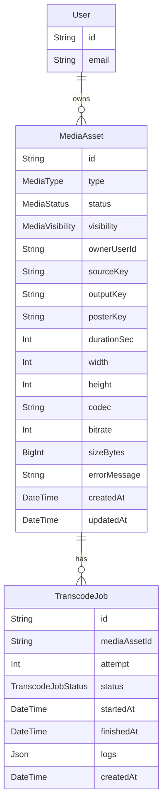

# Sprint 7 – Phase 1 Media ERD

```mermaid
erDiagram
  User ||--o{ MediaAsset : owns
  MediaAsset ||--o{ TranscodeJob : has

  User {
    String id
    String email
  }

  MediaAsset {
    String id
    MediaType type
    MediaStatus status
    MediaVisibility visibility
    String ownerUserId
    String sourceKey
    String outputKey
    String posterKey
    Int durationSec
    Int width
    Int height
    String codec
    Int bitrate
    BigInt sizeBytes
    String errorMessage
    DateTime createdAt
    DateTime updatedAt
  }

  TranscodeJob {
    String id
    String mediaAssetId
    Int attempt
    TranscodeJobStatus status
    DateTime startedAt
    DateTime finishedAt
    Json logs
    DateTime createdAt
  }
```
